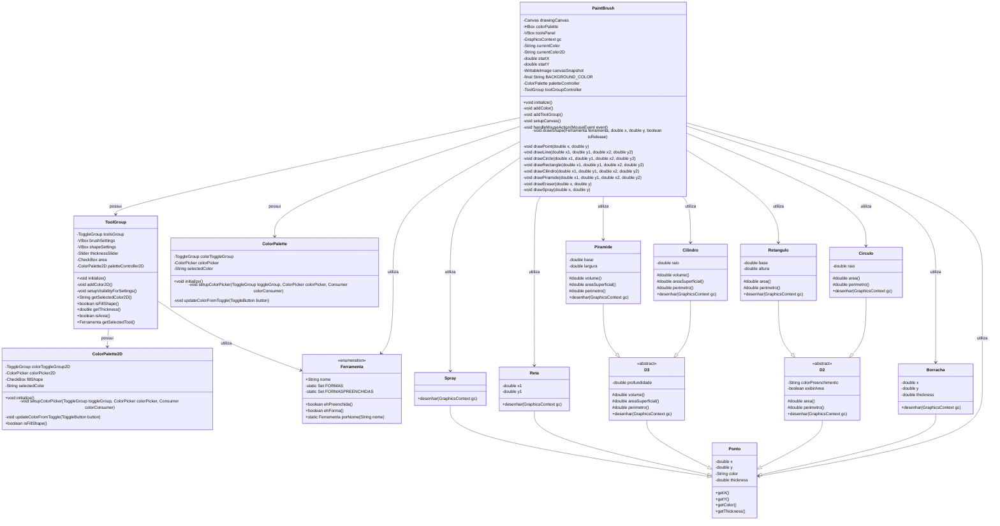

# PaintBrush 🎨

**PaintBrush** é um projeto acadêmico que simula uma ferramenta de pintura digital, permitindo a criação e manipulação de formas geométricas em 2D e 3D. Desenvolvido em Java com JavaFX, oferece uma interface gráfica intuitiva para desenhar e calcular propriedades de formas como pontos, retas, círculos, retângulos, cilindros e pirâmides. O projeto visa proporcionar uma experiência prática e divertida no mundo da geometria computacional, enquanto permite a visualização e cálculos automáticos de área, perímetro e volume para cada forma desenhada.

[](https://www.oracle.com/java/)
[](https://openjfx.io/)
[](https://wakatime.com/badge/user/5a343522-23db-45ae-b20b-54655c392390/project/34a88cbe-b514-48b1-a919-c80c09189897)

---

## Sumário 📑

- [Funcionalidades 🛠️](#funcionalidades-)
- [Diagrama de Classes 📊](#diagrama-de-classes-)
- [Tecnologias Utilizadas 💻](#tecnologias-utilizadas-)
- [Como Executar o Projeto 🚀](#como-executar-o-projeto-)
- [Estrutura do Projeto 📂](#estrutura-do-projeto-)
- [Licença 📝](#licença-)

---

## Funcionalidades 🛠️

O **PaintBrush** oferece uma série de funcionalidades interativas e automáticas para trabalhar com formas geométricas. As funcionalidades estão divididas em duas principais categorias: **2D** e **3D**.

### **Formas 1D**
1. **Ponto**
   - Desenho de um ponto na tela com coordenadas (x, y).
   - O ponto pode ter a cor alterada e pode ser movido interativamente na interface gráfica.

2. **Borracha**
   - A borracha é uma forma 2D interativa que pode apagar outras formas na tela.
   - O tamanho da borracha pode ser ajustado, e ela pode apagar uma área específica ao ser movida sobre as formas desenhadas.
     
3. **Reta**
   - Desenha uma reta entre dois pontos específicos.
   - A reta pode ter sua espessura e cor alteradas.
   - Cálculos automáticos de comprimento da reta.

### **Formas 2D**

1. **Círculo**
   - Desenho de um círculo baseado no raio e no centro.
   - Cálculos automáticos de área e perímetro do círculo.

2. **Retângulo**
   - Desenha um retângulo a partir das coordenadas de dois pontos diagonais.
   - Calcula automaticamente a área e o perímetro.

### **Formas 3D**
1. **Cilindro**
   - Desenha um cilindro com um raio e altura fornecidos.
   - Cálculos automáticos de área lateral, área total e volume.

2. **Pirâmide**
   - Desenha uma pirâmide com base retangular.
   - Cálculos automáticos de área e volume.

### **Operações Comuns**
- **Desenho Interativo**: As formas geométricas podem ser desenhadas diretamente na interface gráfica.
- **Cálculos Automáticos**: Cada forma tem cálculos automáticos de área, perímetro e volume.
- **Personalização de Cores e Tamanho**: As formas podem ser personalizadas em termos de cor e tamanho diretamente na interface.
- **Zoom e Movimentação**: A interface gráfica permite zoom in/out para facilitar o desenho de formas de diferentes tamanhos.

---

## Diagrama de Classes 📊

O **PaintBrush** segue uma arquitetura orientada a objetos robusta, com classes bem definidas para cada tipo de forma geométrica. Veja abaixo o diagrama de classes do projeto, representando a hierarquia de objetos.



---

## Tecnologias Utilizadas 💻

O **PaintBrush** foi desenvolvido com as seguintes tecnologias e frameworks:

### **Linguagem de Programação**
- **Java 17 ou superior**: A principal linguagem utilizada no desenvolvimento do projeto, com foco em uma arquitetura robusta e eficiente.

### **Frameworks e Bibliotecas**
- **JavaFX 23**: Framework para criação de interfaces gráficas ricas e interativas.
  - **JavaFX Controls**: Componentes de UI como botões, sliders, campos de texto e muito mais.
  - **JavaFX FXML**: Arquitetura para criar interfaces gráficas com arquivos FXML.
  - **JavaFX CSS**: Para estilização da interface gráfica.
- **Lombok 1.18.24**: Biblioteca para reduzir o boilerplate code, utilizando anotações como `@Getter`, `@Setter`, `@NoArgsConstructor`, etc.
- **ControlsFX 11.2.0**: Biblioteca para adicionar componentes avançados à interface, como botões customizados, caixas de diálogo e menus.

### **Ferramentas de Desenvolvimento**
- **Maven 3.8.4**: Ferramenta de build e gerenciamento de dependências.
- **VS Code (Visual Studio Code)**: Editor de código com suporte para Java, JavaFX, Maven e outras ferramentas úteis.

---
## Como Executar o Projeto 🚀

### Requisitos

Antes de executar o projeto, certifique-se de que você possui os seguintes requisitos instalados:

- **Java 17** ou superior.
- **Maven**: Para gerenciamento de dependências e execução do projeto.
- **JavaFX 23**: O projeto já inclui as dependências corretas do JavaFX.

### Passos para Executar

1. **Clone o repositório**:

   Se ainda não fez o clone do repositório, execute o comando abaixo no terminal:

   ```bash
   git clone https://github.com/StephanyeCunto/PaintBrush.git
2. **Navegue até o diretório do projeto**:

   Após clonar o repositório, entre no diretório do projeto usando o comando abaixo:

   ```bash
   cd PaintBrush
3. **Compile o projeto usando Maven**:

   Para compilar o projeto e resolver todas as dependências, execute o comando Maven:

   ```bash
   mvn clean install
Este comando realiza as seguintes ações:
- **`clean`**: Limpa qualquer build anterior, removendo arquivos temporários e de compilação gerados nas execuções anteriores. Isso garante que o build atual seja limpo e sem conflitos com versões antigas.
- **`install`**: Baixa todas as dependências necessárias definidas no arquivo `pom.xml` e compila o código-fonte do projeto. O Maven também resolve quaisquer dependências externas e gera os arquivos de bytecode necessários para a execução do projeto.

Após a execução deste comando, o Maven criará o arquivo `.jar` ou `.war` (dependendo da configuração) que pode ser executado ou distribuído.

### Se houver algum erro durante a compilação:

- Verifique se todas as dependências estão corretamente configuradas no arquivo `pom.xml`.
- Verifique se as versões do Java e do JavaFX são compatíveis com o seu ambiente de desenvolvimento.
- Se houver problemas com dependências específicas, tente limpar o cache do Maven com o comando `mvn clean install -U`.


4. **Execute o projeto**:

Após compilar o projeto, você pode rodá-lo localmente com o seguinte comando Maven:

```bash
mvn javafx:run
```
Este comando utiliza o plugin JavaFX do Maven para iniciar a aplicação. Ao executá-lo, o Maven irá buscar o arquivo de configuração do JavaFX no `pom.xml` e iniciar o processo de execução da interface gráfica.

### O que acontece ao executar o comando:

1. **Busca pelo arquivo `pom.xml`**:
   O Maven verifica o arquivo `pom.xml` para garantir que as dependências necessárias para o JavaFX estejam incluídas no projeto. Ele usa o plugin `javafx-maven-plugin` para lidar com a execução do código JavaFX, garantindo que todas as bibliotecas e configurações estejam corretamente carregadas.

2. **Inicialização da Aplicação**:
   O Maven executa a classe principal definida no `pom.xml` e inicializa a aplicação JavaFX. A partir daqui, o JavaFX gerencia o ciclo de vida da interface gráfica, incluindo a renderização das formas geométricas e interações com o usuário.

3. **Carregamento da Interface Gráfica**:
   A interface gráfica será carregada com base nos arquivos FXML, CSS e outros recursos que você configurou no projeto. O usuário verá a tela do **PaintBrush**, podendo interagir com as formas geométricas.

### Caso o comando falhe:

- **Problema de Dependência JavaFX**: Certifique-se de que as dependências do JavaFX estão corretamente especificadas no `pom.xml`. Verifique também se você está utilizando a versão correta do Java (Java 11 ou superior) para o projeto.
- **Erro de `javafx-maven-plugin`**: Se houver problemas com o plugin, tente atualizar ou ajustar a versão do plugin no `pom.xml` para a versão mais recente ou compatível com sua versão do JavaFX.
- **Erros de Inicialização**: Caso o programa falhe durante a execução, confira os logs de erro gerados pelo Maven. Eles geralmente indicam o que pode estar causando a falha, como problemas com o carregamento de arquivos FXML ou falta de recursos.

---

## Estrutura do Projeto 📂

O projeto está organizado da seguinte forma:

```plaintext
PaintBrush/
├── src/
│   ├── main/
│   │   ├── java/ # Código-fonte Java
│   │   │   ├── com/example/
│   │   │   │   ├── App.java # Classe principal
│   │   │   │   ├── models/ # Classes das formas geométricas
│   │   │   │   └── views/ # Classes de interface gráfica
│   │   └── resources/ # Recursos como CSS, imagens, etc.
├── pom.xml # Arquivo de configuração do Maven

```
### Descrição das Pastas e Arquivos

- **`src/main/java/`**: Contém todo o código-fonte Java do projeto.
  - **`com/`**: Pacote raiz do projeto.
    - **`App.java`**: Classe principal que inicia a aplicação. Aqui é onde o método `main` é definido, e o ciclo de vida da aplicação é controlado.
    - **`models/`**: Contém as classes que representam as formas geométricas. Cada forma, como `Ponto`, `Círculo`, `Retângulo`, `Cilindro` e `Pirâmide`, possui sua própria classe responsável por gerenciar as propriedades e comportamentos dessa forma.
      - **`Ponto.java`**: Representa um ponto no espaço, com coordenadas (x, y) e a cor atribuída ao ponto.
      - **`Circulo.java`**: Define um círculo, com propriedades de raio e métodos para calcular área e perímetro.
      - **`Retangulo.java`**: Define um retângulo, com propriedades de base e altura, incluindo métodos para calcular área e perímetro.
      - **`Cilindro.java`**: Representa um cilindro, com propriedades de raio e altura, e métodos para calcular a área, o volume e o perímetro.
      - **`Piramide.java`**: Define uma pirâmide, com propriedades de base e altura, além de métodos para calcular área, volume e perímetro.
    - **`views/`**: Contém as classes responsáveis pela interface gráfica da aplicação, onde os controles e elementos visuais são definidos.
      - **`PaintBrush.java`**: Classe que gerencia a criação da interface gráfica, incluindo os eventos de interação do usuário e a renderização das formas geométricas.
      - **`FormaRenderer.java`**: Responsável por desenhar as formas na tela, atualizando a interface conforme o usuário interage com os controles.

- **`src/main/resources/`**: Armazena recursos utilizados pelo projeto.
  - **`style.css`**: Arquivo de estilos CSS que define a aparência da interface gráfica, como cores, tamanhos e layouts dos componentes da aplicação.
  - **`paintbrush.fxml`**: Arquivo FXML que descreve a interface gráfica de forma declarativa. Contém a definição dos elementos visuais como botões, caixas de texto, e áreas de desenho.
  - **`icon.png`**: Arquivo de imagem utilizado como ícone do aplicativo ou para elementos gráficos na interface.

- **`pom.xml`**: Arquivo de configuração do Maven, onde são definidas as dependências, plugins e configurações necessárias para o projeto. Ele garante que todas as bibliotecas e frameworks corretos, como JavaFX e ControlsFX, sejam incluídos no processo de construção e execução do projeto.

- **`README.md`**: Este arquivo de documentação do projeto, que fornece informações sobre a configuração, execução e funcionalidades do projeto **PaintBrush**. Ele também contém detalhes sobre a estrutura do projeto, tecnologias utilizadas e como contribuir.

### Fluxo de Trabalho do Projeto

1. **Desenvolvimento da Lógica**: O desenvolvimento da lógica do projeto se concentra principalmente nas classes dentro de `models/`, onde são implementadas as propriedades e comportamentos das formas geométricas. O código de renderização é centralizado nas classes de `views/`, que utilizam JavaFX para exibir as formas na tela e responder às interações do usuário.

2. **Interface Gráfica**: A interface é desenhada utilizando o JavaFX, com a definição de elementos visuais e interação armazenados no arquivo `paintbrush.fxml` (FXML). Isso permite que a interface seja mantida separada da lógica de negócios, seguindo os princípios de arquitetura MVC.

3. **Compilação e Execução**: O Maven cuida da compilação e execução do projeto, incluindo a resolução das dependências e a execução da interface gráfica, graças à configuração especificada no `pom.xml`. O Maven garante que o JavaFX esteja corretamente configurado e que as dependências necessárias sejam baixadas e incluídas durante o processo de construção.

---

## Licença 📜

Este projeto está licenciado sob a Licença MIT. Consulte o arquivo [LICENSE](LICENSE) para mais informações.

### Resumo da Licença MIT

A Licença MIT é uma licença permissiva de código aberto que permite que você faça praticamente tudo o que desejar com o código, como usá-lo, copiá-lo, modificá-lo, mesclá-lo, publicá-lo, sublicenciá-lo e/ou vendê-lo. No entanto, deve ser mantida a seguinte condição:

- **Aviso de Copyright e Isenção de Responsabilidade**: O código, quando redistribuído, deve incluir o aviso de copyright original e a isenção de responsabilidade, sem alterações.

