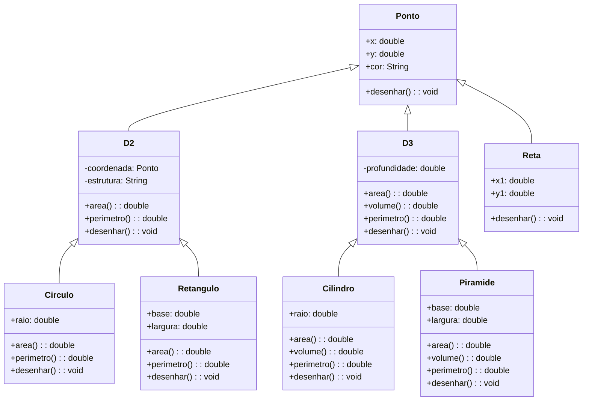

# PaintBrush 🎨

O **PaintBrush** é um projeto acadêmico que simula uma ferramenta de pintura digital, permitindo a criação e manipulação de formas geométricas em 2D e 3D. Desenvolvido em Java com JavaFX, o projeto oferece uma interface gráfica intuitiva para desenhar e calcular propriedades de formas como pontos, retas, círculos, retângulos, cilindros e pirâmides.

---

## Funcionalidades Principais ✨

O **PaintBrush** oferece as seguintes funcionalidades:

### Formas 2D
- **Ponto**: Desenha um ponto na tela com coordenadas (x, y) e cor personalizável.
- **Reta**: Desenha uma reta entre dois pontos (x1, y1) e (x2, y2).
- **Círculo**: Desenha um círculo com raio e centro definidos, calculando área e perímetro.
- **Retângulo**: Desenha um retângulo com base e altura definidas, calculando área e perímetro.

### Formas 3D
- **Cilindro**: Desenha um cilindro com raio e altura definidos, calculando área, volume e perímetro.
- **Pirâmide**: Desenha uma pirâmide com base e altura definidas, calculando área, volume e perímetro.

### Operações Comuns
- **Desenhar**: Todas as formas podem ser renderizadas na interface gráfica.
- **Cálculos Automáticos**: Área, perímetro e volume são calculados automaticamente para cada forma.
- **Personalização**: Cores e dimensões das formas podem ser ajustadas.

---

## Diagrama de Classes 📊

O projeto segue uma estrutura orientada a objetos, com classes bem definidas para cada forma geométrica. Abaixo está o diagrama de classes:


## Tecnologias Utilizadas 🛠️

O **PaintBrush** foi desenvolvido utilizando as seguintes tecnologias, frameworks e ferramentas:

### Linguagem de Programação
- **Java (JDK 11 ou superior)**: Linguagem principal do projeto, utilizada para implementar a lógica do programa e a interface gráfica.

### Frameworks e Bibliotecas
- **JavaFX 23**: Framework para criação de interfaces gráficas modernas e responsivas. Utilizado para renderizar as formas geométricas e fornecer uma experiência de usuário interativa.
  - **JavaFX Controls**: Componentes de UI como botões, menus e caixas de diálogo.
  - **JavaFX FXML**: Para definir a interface gráfica de forma declarativa.
- **Lombok 1.18.24**: Biblioteca que simplifica o código Java com anotações como `@Getter`, `@Setter`, `@NoArgsConstructor`, entre outras, reduzindo a necessidade de escrever código boilerplate.
- **ControlsFX 11.2.0**: Biblioteca que fornece componentes de UI avançados e modernos, como caixas de diálogo personalizadas e controles adicionais.

### Ferramentas de Desenvolvimento
- **Maven 3.8.4**: Ferramenta de gerenciamento de dependências e build do projeto. Utilizada para compilar, empacotar e executar o projeto.
- **VS Code (Visual Studio Code)**: Editor de código utilizado para desenvolvimento, com extensões como:
  - **Extension Pack for Java**: Suporte para desenvolvimento Java, incluindo debugging, linting e gerenciamento de projetos Maven.
  - **Maven for Java**: Integração com projetos Maven.
  - **JavaFX Support**: Suporte para desenvolvimento com JavaFX.

---

## Como Executar o Projeto

### Requisitos

Antes de executar o projeto, verifique se você tem os seguintes requisitos instalados:

- **Java 11** ou superior
- **Maven** (para gerenciamento de dependências e execução do projeto)
- **JavaFX 23** (o projeto já inclui as dependências corretas)

### Passos para Executar

1. **Clone o repositório**:

   Se ainda não fez o clone do repositório, execute o comando abaixo no terminal:

   ```bash
   git clone https://github.com/StephanyeCunto/PaintBrush.git

2. **Navegue até o diretório do projeto**:
    ```bash
    cd PaintBrush
    ```
3. **Compile o projeto usando Maven**:

   ```bash
   mvn clean install

4. **Execute o projeto**:

   Para rodar o projeto, use o comando Maven abaixo:

   ```bash
   mvn javafx:run
---

## Estrutura do Projeto 📂

O projeto está organizado da seguinte forma:

```plaintext
PaintBrush/
├── src/
│   ├── main/
│   │   ├── java/ # Código-fonte Java
│   │   │   ├── com/example/
│   │   │   │   ├── App.java # Classe principal
│   │   │   │   ├── models/ # Classes das formas geométricas
│   │   │   │   └── views/ # Classes de interface gráfica
│   │   └── resources/ # Recursos como CSS, imagens, etc.
├── pom.xml # Arquivo de configuração do Maven
```

### Descrição das Pastas e Arquivos
- **`src/main/java/`**: Contém todo o código-fonte Java do projeto.
  - **`com/`**: Pacote raiz do projeto.
    - **`App.java`**: Classe principal que inicia a aplicação.
    - **`models/`**: Contém as classes das formas geométricas (ex: `Ponto.java`, `Circulo.java`, `Retangulo.java`).
    - **`views/`**: Contém as classes relacionadas à interface gráfica (ex: `PaintBrush.java`).
- **`src/main/resources/`**: Armazena recursos como arquivos CSS, imagens, e arquivos FXML.
- **`pom.xml`**: Arquivo de configuração do Maven, onde são definidas as dependências e plugins do projeto.
- **`README.md`**: Documentação do projeto (este arquivo).
